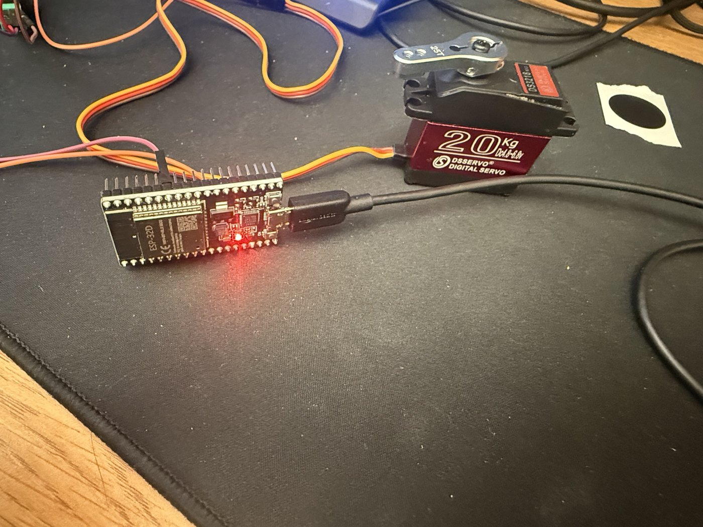
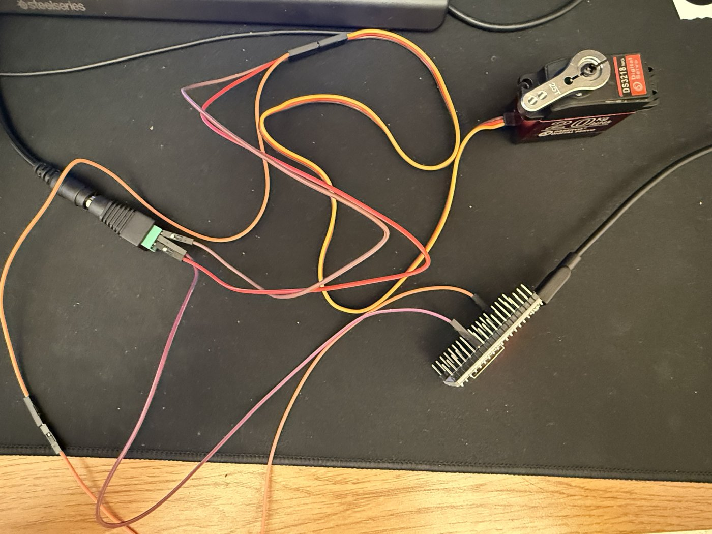

# dorm-lock

This is a work in progress.. esp32 + servo to turn the thumb-turn on my dorm door, from my phone. the mechanics are done, tapping my phone on an nfc tag spins the servo in under a second. only thing left is mounting it on the door (3d printed parts).

demo video coming soon

 

esp32 + the 20kg servo, and the wiring (5v supply goes into the green terminal block). not mounted yet, just on my desk

## how it works

```
tap nfc tag -> ios shortcut -> cloudflare worker -> mac -> bluetooth -> esp32 -> servo
```

- tap the nfc tag on the door, an ios shortcut sends "toggle" to a cloudflare worker
- my mac is always polling the worker, picks it up and sends it to the esp32 over bluetooth
- the esp32 moves the servo and reports back, so the phone shows if it actually worked

why the mac: at first the esp32 was on the dorm wifi itself, but the signal at the door is like -85 dBm and the connection kept hanging. my mac is on 24/7 anyway bc it runs my polymarket bot ([prediction-market-making](https://github.com/Tanuj-07/prediction-market-making)), so now it does the internet part and the esp32 only does bluetooth.

the worker turns "toggle" into an absolute locked/unlocked, so a double tap cant flip it back, and old cmds expire after 60s so nothing fires late. the bluetooth cmds are signed so some random phone nearby cant unlock it.

Note: the servo locks movement when connected, so the 3D printed part that will be used for the servo to turn the lock will rest in a position that does not impede regular key usage. This avoids almost all failure modes, though there are things that could still break it, like power loss while the servo is in the middle of movement.

## status

- [x] cloudflare worker
- [x] ios shortcut + nfc tag
- [x] esp32 firmware (bluetooth)
- [x] mac bridge, runs on its own at login
- [x] end to end: tap -> servo moves
- [ ] mount it on the door (3d printed parts) + calibrate the servo angles
- [ ] rate limiting

## whats where

- `src/` - the cloudflare worker (+ a durable object that holds the lock state)
- `firmware/dorm_lock_ble/` - esp32 firmware. `firmware/dorm_lock/` is the old wifi version, not used anymore
- `bridge/` - the mac side (python + bleak), plus a little launcher app + launchd plist so it runs at login
- `test/` - tests that dont need any hardware, `device-sim` fakes the esp32 side
- [SHORTCUTS.md](SHORTCUTS.md) - how to make the ios shortcut + nfc automation

## setup

**worker**
```bash
npm install
npx wrangler login
npx wrangler deploy
npx wrangler secret put SHARED_SECRET
```

**esp32** - open `firmware/dorm_lock_ble` in arduino ide (board "ESP32 Dev Module"). copy `secrets.example.h` to `secrets.h` and put in a key (`python3 -c "import secrets; print(secrets.token_hex(32))"`). set `CALIBRATE_MODE 1` first to find the servo angles before putting it on the lock. servo signal on gpio 13, powered from its own 5v supply (not the esp32), with the grounds tied together.

**mac**
```bash
python3 -m venv ~/dorm-lock-venv
~/dorm-lock-venv/bin/pip install -r bridge/requirements.txt
cp bridge/config.example.json bridge/config.json   # worker url, secret, same ble key as the esp32
~/dorm-lock-venv/bin/python3 bridge/bridge.py
```
dont use python 3.9.0, it has a bug that breaks bleak. to run it at login build the launcher app in `bridge/` and load the plist (change the paths, theyre for my mac).

## notes

- fits in cloudflare's free tier: ~3.5k of 100k requests/day, ~11k of 13k GB-s/day durable object time
- all the keys are gitignored. the worker secret is basically the key to the door
- keep a real key on you, wifi / power / cloudflare / the mac can all go down
